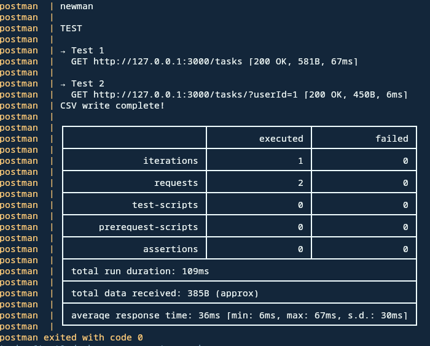

# TestApi

Simple project to use postman in a docker container for testing REST API.

## Requirements

* [Taskfile](https://taskfile.dev/)
* [Docker Compose](https://docs.docker.com/compose/)

## Setup

After downloading the project run the following commands

```bash
task build
task test
```

if everything works fine, you should see on screen something similar



## How to use it

In order to test your collection you must add it in `/collections/`. Then add a `config-name` file in `./config/` respecting the following format:

```bash
COLLECTION=YOUR-COLLECTION.json
ENVIRONMENT=testENV.json
```

where `YOUR-COLLECTION.json` is the collection file you just added in `/collections/`.
In case your collection needs some enviroment variables you can add the file with them in `./collections/` and replace `testENV.json` with its filename in`config-name`.
>In anycase the file linked to the `ENVIRONMENT` variable cannot be an empty file. So if you don't have any enviroment variable to define just leave `ENVIRONMENT=testENV.json`.

Now you have everything settup and ready to be run. To test your collection just type `task run -- config-name` 